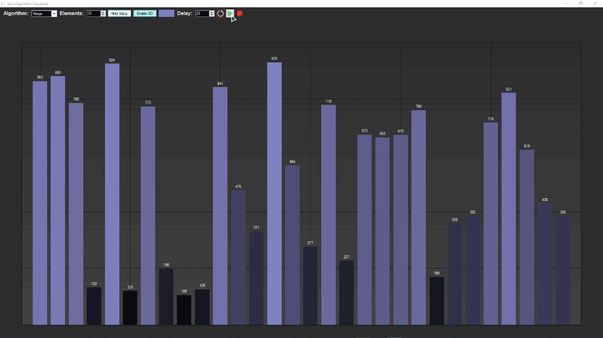
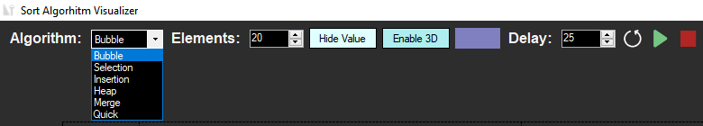

# Sort Algorithm Visualizer
Visualizer of sorting algorithms on Windows Forms (C#). The program is created by fan. The task was to get acquainted with sorting algorithms, visualize them, and practice OOP.

     
    
     
    <a href="https://youtu.be/jA66vzA2O3w" style="font-weight: bold; font-size: 20px">Watch Demo!</a>

## Algorithms
The following sorting algorithms are available:
- Bubble
- Selection
- Insertion
- Heap
- Merge
- Quick

## Controls
You can: 
- set the sort algorithm
- set the number of array elements
- enable/disable the values of each point
- enable/disable the display of points in 3D
- set the color of points
- set the delay between operations
- rearrange the graph
- start sorting
- stop sorting

     
    

